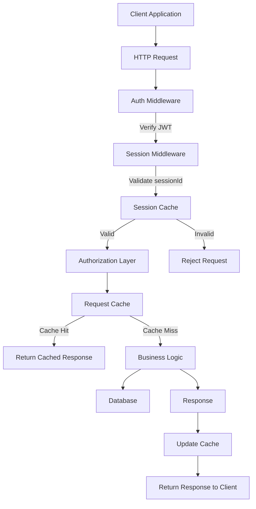

## 🏗️ System Architecture Overview

This API is designed with a focus on **security, scalability, and performance**.
It follows a layered backend architecture combining **JWT-based authentication**, **server-side session validation**, and **request-level caching**.

---

## 🔐 Authentication & Session Design

The system uses a **hybrid authentication model**:

* **JWT (stored in HTTP-only cookies)** for client authentication
* **Session ID embedded in JWT payload**
* **Cache-backed session store** for validation

This approach provides:

* Stateless client communication
* Server-side control over sessions (revocation support)
* Improved security over pure JWT systems

---

## ⚙️ Request Lifecycle

Every incoming request follows this pipeline:

1. **Client Request**
2. **JWT Extraction (from cookie)**
3. **Authentication Middleware**

   * Verifies JWT integrity
4. **Session Middleware**

   * Extracts `sessionId`
   * Validates against session cache
5. **Authorization Layer**

   * Ensures access permissions
6. **Request Cache Check**

   * Returns cached response if available
7. **Business Logic Execution**
8. **Response Returned**

---

## 🧠 Architecture Diagram

---

## 🚀 Key Engineering Decisions

### 1. Hybrid JWT + Session Validation

Instead of
